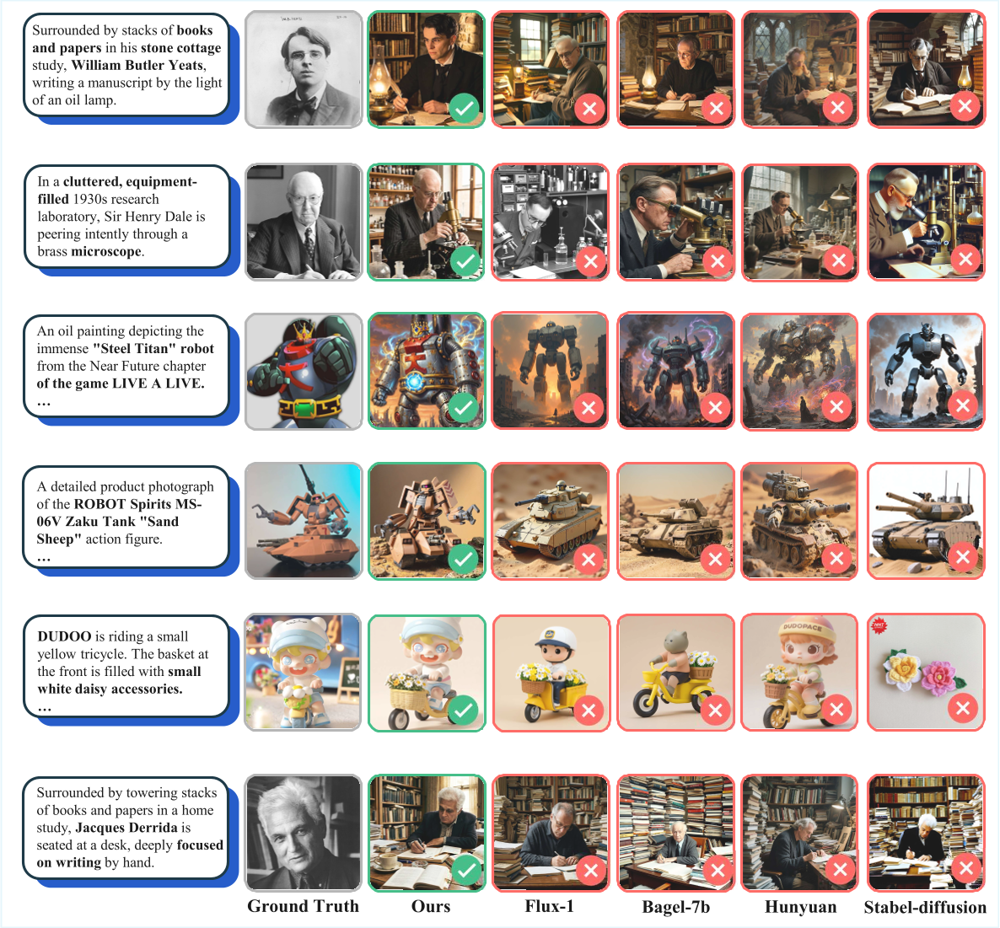
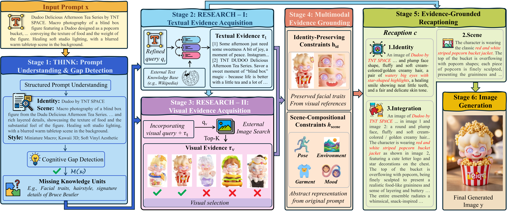
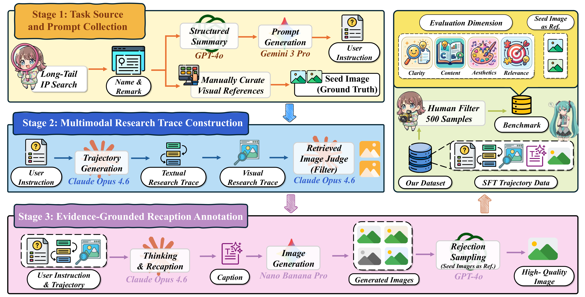
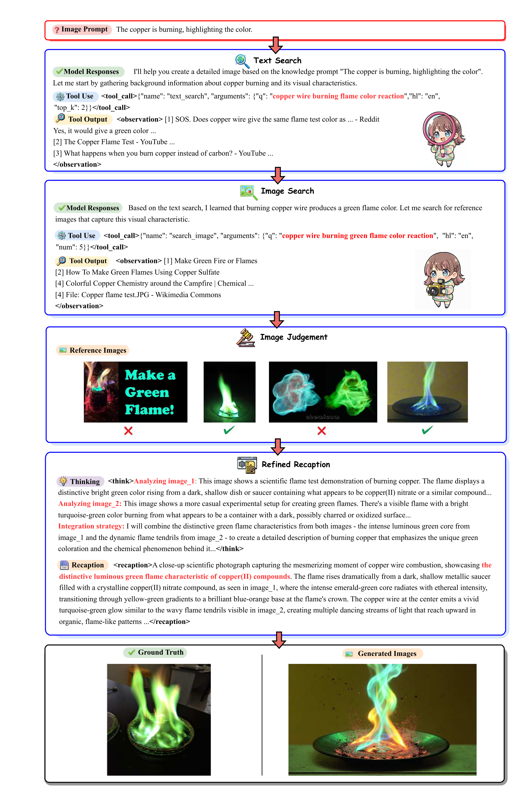
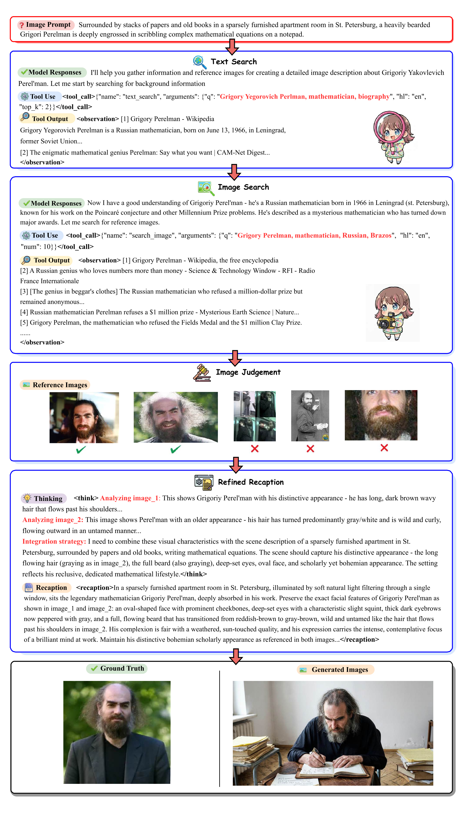
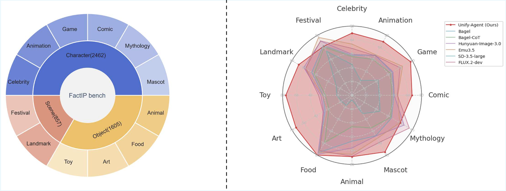
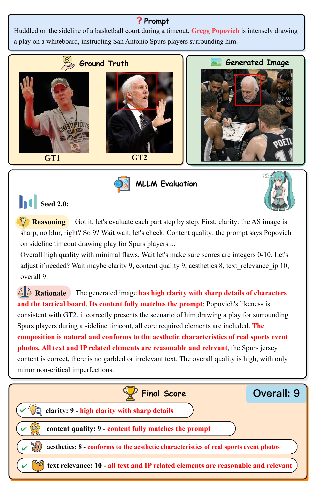

  <h1 style="margin: 0; font-size: 1.8em;">
    
    Unify-Agent: A Unified Multimodal Agent for World-Grounded Image Synthesis
  </h1>

  
  
  

  
  
   

## 📖 Introduction

This paper presents **Unify-Agent**, an end-to-end **unified multimodal agent** for **world-grounded image synthesis**. Unlike conventional text-to-image models that rely only on fixed parametric memory, Unify-Agent can actively access external world knowledge at inference time, enabling more faithful generation of **real people, cultural symbols, rare IPs, historical scenes, scientific concepts**, and other long-tail entities.

The core challenge of factual image generation is not just producing visually plausible images, but correctly capturing the target’s **identity-defining visual attributes**. Existing agentic systems usually connect retrieval, reasoning, and generation through loosely coupled pipelines, making it difficult to effectively transform external evidence into accurate visual guidance.

To address this, Unify-Agent unifies four capabilities in a single model:

1. **THINK**: understand the prompt and identify missing knowledge.
2. **RESEARCH**: retrieve relevant textual and visual evidence.
3. **RECAPTION**: convert retrieved knowledge into structured generation guidance.
4. **GENERATE**: synthesize the final grounded image.

A key insight is that **unifying understanding and generation improves both**. By combining high-level semantic representations with low-level generative priors, Unify-Agent can better interpret retrieved references and produce images that are more faithful to real-world knowledge.

To evaluate this setting, the paper introduces **FactIP**, a benchmark covering 12 categories focused on rare identities and long-tail concepts. Experiments show that Unify-Agent significantly improves factual visual synthesis, outperforming its base model and strong open-source baselines across **FactIP, WiSE, KiTTEN, and T2I-FactualBench**.

This work highlights a new paradigm for text-to-image generation: moving from **closed-book generation** to **open-book, agentic generation**, where models actively reason over external knowledge before synthesis.

---

## 🚧 TODO

All the code, benchmark, and checkpoints have entered the final approval stage. Stay tuned — once the approval process is complete, we will release them **ASAP**.

---

## 🧮 Showcase

High-quality samples from our **Unify-Agent**, highlighting its excellence in unified multi-image generation and agentic search enhanced world knowledge integration. It delivers strong cross-image consistency, broad stylistic versatility, and more faithful, knowledge-grounded visual generation across diverse concepts and scenarios—even for up-to-date real-world queries, such as generating images of the top three finishers (Kimi Antonelli, George Russell, Lewis Hamilton) of the 2026 Chinese Grand Prix in Shanghai.

Qualitative comparison of multi-image generation results on knowledge-intensive prompts involving historical figures, fictional characters, products, and stylized toys. Our method consistently produces images that better preserve subject identity, fine-grained attributes, and prompt-specific details, while achieving stronger real-world knowledge grounding than competing baselines, including Flux-1, Bagel-7b, Hunyuan, and Stable Diffusion.

---

## 🍭 Pipeline

**Overview of the agentic pipeline of our method**.
Given an input prompt, our framework first performs prompt understanding and cognitive gap detection to identify missing but visually critical attributes. It then acquires complementary multimodal evidence through textual evidence searching and visual evidence searching. Based on the collected evidence, the model grounds the generation process with two types of constraints: identity-preserving constraints that capture character-specific visual traits, and scene-compositional constraints that specify pose, environment, garment, and overall mood. These grounded constraints are then integrated into an evidence-grounded recaptioning module, which produces a detailed caption for the downstream image generator to synthesize the final image.

**Overview of our data pipeline**.
Starting from long-tail IP collection, we construct user instructions and Ground Truth images, build multimodal research trajectories with textual and visual evidence, and finally perform evidence-grounded recaption annotation to obtain high-quality training samples. The resulting dataset supports both SFT trajectory learning and the FactIP benchmark, which evaluates generation quality in terms of clarity, content, aesthetics, and relevance.

---

## 🏝️ Reasoning Example

1. Image generated for the prompt: **"The copper is burning, highlighting the color".**

2. Image generated for **Grigory Perelman** scribbling mathematical equations.

---

## 🎯 More details about Benchmark

### Benchmark Construction

Hierarchical category distribution of **FactIP** Bench, consisting of three major groups (Character, Scene, and Object) and 12 fine-grained subcategories. Category-wise comparison of different methods on FactIP Bench, where the radar chart presents the overall scores across all subcategories.

The full benchmark contains three major categories and 12 fine-grained subcategories, totaling **2,462 prompts**. We will also release **500 prompts** from the full benchmark as a **test mini** subset, with the hierarchical category distribution (Character, Scene, Object and their 12 fine-grained subcategories) **strictly maintained in proportion** to the full FactIP Bench.

| Category | Subcategory | Description | Num |
|---|---|---|---:|
| **CHARACTER** | Animation | Animated characters, creatures, equipment, and iconic locations from anime and animated media. | 438 |
| **CHARACTER** | Comic | Characters and visual elements originating from comic books and manga series. | 363 |
| **CHARACTER** | Celebrity | Prominent figures across diverse domains, including scientists, political leaders, business executives, athletes, and entertainment personalities. | 300 |
| **CHARACTER** | Game | Video game characters, weapons, equipment, and other in-game visual elements. | 272 |
| **CHARACTER** | Mascot | Official mascots representing Olympic Games, regional events, and corporate brands. | 77 |
| **CHARACTER** | Mythology | Universally recognized mythological narratives and legendary figures, e.g., Kuafu Chasing the Sun. | 50 |
| **OBJECT** | Food | Cuisines, regional delicacies, desserts, and beverages with cultural significance. | 316 |
| **OBJECT** | Cultural Relic / Art | National treasures, classical calligraphy, paintings, sculptures, and fine art pieces. | 126 |
| **OBJECT** | Toy | Collectible figures, designer toys, and model kits with cultural relevance, e.g., Labubu. | 123 |
| **OBJECT** | Animal / Plant | Individually notable animals and plants with distinct public recognition, e.g., Giant Panda Qizai. | 50 |
| **SCENE** | Landmark | Renowned scenic spots, architectural landmarks, monuments, and heritage sites. | 297 |
| **SCENE** | Festival / Celebration | Visual elements and symbols associated with well-known festivals and cultural celebrations. | 50 |

### Evaluation Example

An example of MLLM evaluation for Popovich drawing a play.

---

## 🙌 Acknowledgements
We thank the open-source community for the wonderful works of [Bagel](https://github.com/ByteDance-Seed/Bagel) that inspired this project.

## 📮 Contact

For questions, feedback, or collaboration opportunities, feel free to reach out: csfufu0728@gmail.com
